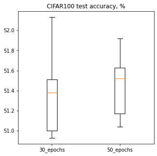

# Cross entropy

This experiment tries to achieve the best possible validation accuracy on CIFAR100 dataset using the resnet18 architecture.

In order to do this, I run multiple learning rate and weight decay sweeps for different batch sizes and number of epochs.

All training is done using the `AdamW` optimizer with `OneCycleLR`. Note that with `OneCycleLR` training for more epochs from scratch is not equivalent to training for fewer epochs and then doing an additional fine-tuning because of the difference in learning rate schedules.

I did not try different optimizers as the recent research suggests that `AdamW` tends to give the best performance. This is also supported by the sweep results as in all cases sweeps showed decline in generalization when using smaller weight decay figures.

All sweeps were done using the bayes optimization algorithm with quantized log-normal priors with sigma 1.0 on both learning rate and weight decay. The mu were chosen so that the mode of the distribution would be near 0.02 for learning rate and 0.1 for weight decay. Quantization is done to the 0.005 for learning rate and 0.01 for weight decay. Sweep results:
* batch size 128, 30 epochs available [here](https://wandb.ai/binpord/kd-cifar100-resnet18-cross_entropy-30-epochs-128-bs-sweep/reports/ResNet18-on-CIFAR100-sweep--VmlldzoxOTA4ODAy?accessToken=q7qbsq4cjuqr04h0afpi5zmz45ir69o7atqwdtwcbnny3qfadalpb29t7r4dxzij)
* batch size 256, 30 epochs available [here](https://wandb.ai/binpord/kd-cifar100-resnet18-cross_entropy-30-epochs-256-bs-sweep/reports/ResNet18-on-CIFAR100-sweep--VmlldzoxOTA4ODEw?accessToken=1pp3x6qs38vw92y0hrghhlrcpav66pv08t9s3oobiw3iyqcmrib0tzvaxb99gosw)
* batch size 256, 50 epochs available [here](https://wandb.ai/binpord/kd-cifar100-resnet18-cross_entropy-50-epochs-256-bs-sweep/reports/ResNet18-on-CIFAR100-sweep--VmlldzoxOTExNTYx?accessToken=lq89s2oyphgiu3r2rgo72qmqzies7waqi2fz09ooyuutsjcww5ozn3463to83txr)
* batch size 256, 70 epochs available [here](https://wandb.ai/binpord/kd-cifar100-resnet18-cross_entropy-70-epochs-256-bs-sweep/reports/ResNet18-on-CIFAR100-sweep--VmlldzoxOTExNTMx?accessToken=gde6rbqb1x956qnc14d0znkw3ycwpxig1lfgthx2qc3ayt3f7adx33cp48uluvuy)
* batch size 512, 25 epochs available [here](https://wandb.ai/binpord/kd-cifar100-resnet18-cross_entropy-25-epochs-512-bs-sweep/reports/ResNet18-on-CIFAR100-sweep--VmlldzoxOTA4Nzgw?accessToken=2ffvb754bwdt2yjwunugpq93snjdzot2gy81qffat7bh0crb80cfch488feydbu1)
* batch size 512, 50 epochs available [here](https://wandb.ai/binpord/kd-cifar100-resnet18-cross_entropy-50-epochs-512-bs-sweep/reports/ResNet18-on-CIFAR100-sweep--VmlldzoxOTExNTY4?accessToken=a7wx78rs3idhceamih4prrd8wara19wvn6c3xbmj8z07tiai7tyicd3easjmbv2t)
* batch size 1024, 50 epochs available [here](https://wandb.ai/binpord/kd-cifar100-resnet18-cross_entropy-50-epochs-1024-bs-sweep/reports/ResNet18-on-CIFAR100-sweep--VmlldzoxOTEwODUz?accessToken=jgr8nzz95y6vyhrc6b8gf8rpsmut648ctefdb49ew7a3w7pgd5m9fak9f2yk9me2)

Please note that the number of epochs is not comparable between different batch sizes as each epoch has more/fewer steps.

Overall result is as follows: using batch size of 1024 hurts the generalization, as model only achieves validation accuracy around 50.5%. On the other hand, dropping the batch size down to 128 is also not the best idea as the model only shows around 51% validation accuracy. The second fact may be due to the amount of epochs, however, note that one epoch in such case takes 4 times the amount of steps as compared to batch size 1024, meaning that training time goes up significantly.

The sweet spot I found was the batch size 256 and 30 epochs. Using more epochs doesn't seem to yield improved performance as demonstrated by both sweep results and the following box plot, which visualizes the results of training the model with best learning rate of 0.015 and weight decay of 0.18 for both 30 and 50 epochs 10 times each (the lr and decay are around optimal for both setups as given by the sweep results).

The sweep for 50 epochs with batch size 512 also shows comparable results, however, the increase in batch size makes each step longer, meaning that overall training takes more time (approx. 11 minutes vs 8 minutes on colab) and the empirical results suggest lower quality overall. For this reason I decided to stick with the batch size 256.
